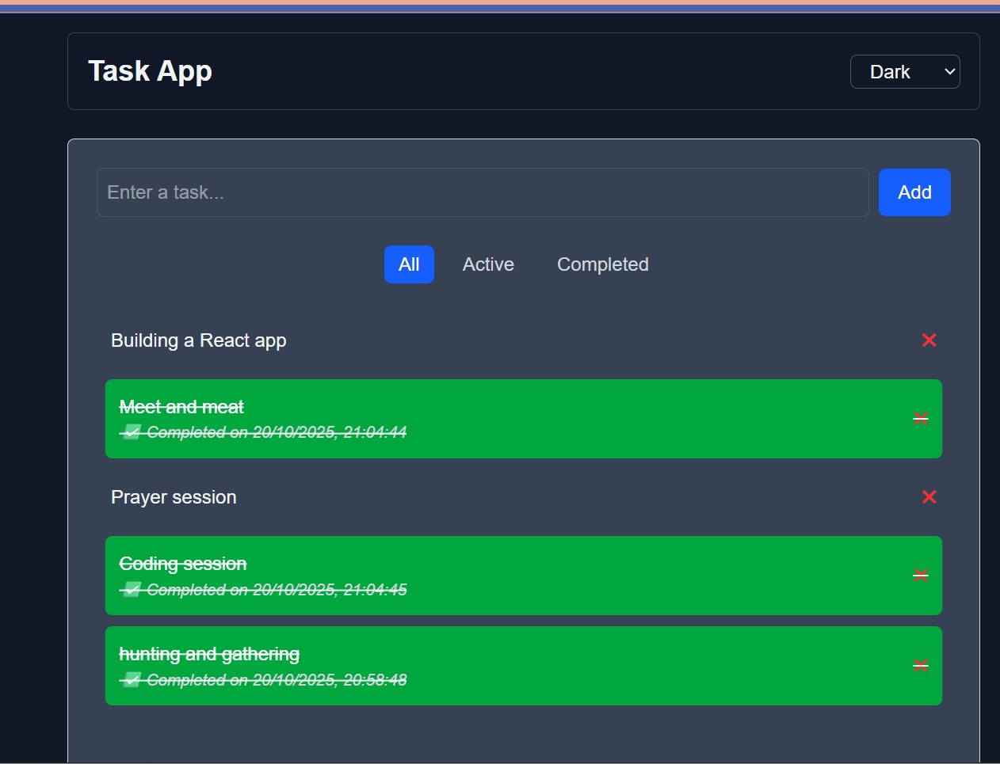
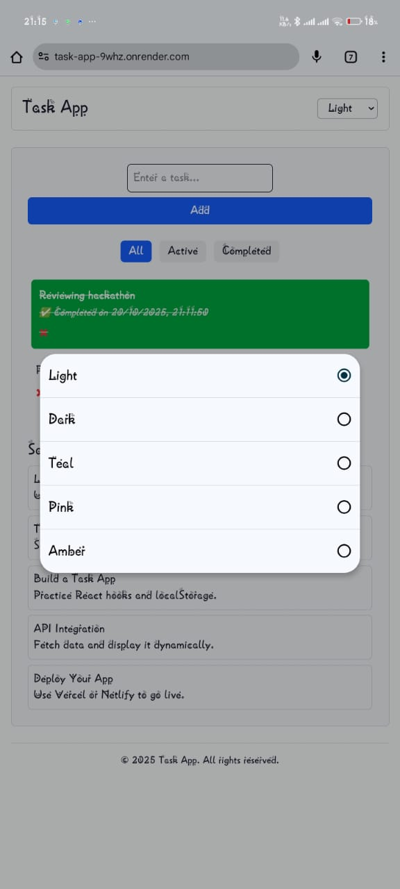
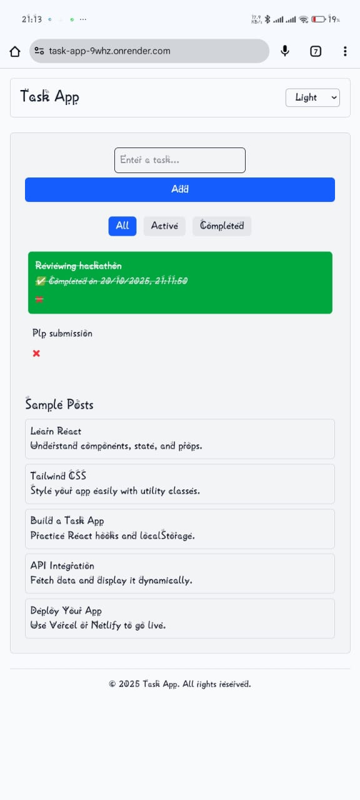

# Task Manager App - Week 3 Assignment

## Project Overview

This project is a **React Task Manager App** built using React, JSX, Tailwind CSS, and TypeScript. It demonstrates:

* Component architecture
* State management with React hooks
* Theme management using `useContext`
* Custom hooks (`useLocalStorage`) for persistent tasks
* Responsive design with Tailwind CSS
* Sample posts section

---

## Features

1. **Task Management**

   * Add tasks
   * Mark tasks as completed
   * Delete tasks
   * Filter tasks: All, Active, Completed
   * Each completed task shows the completion date

2. **Theme Management**

   * Toggle between multiple color themes
   * Themes include Light, Dark, Teal, Pink, Amber

3. **Sample Posts**

   * Static English posts for demonstration
   * Scrollable and responsive layout

4. **Responsive Design**

   * Works on mobile, tablet, and desktop
   * Centered content and clean UI

---

## Project Structure

```
src/
 ├── components/
 │    ├── Button.jsx
 │    ├── TaskManager.jsx
 │    └── Navbar.jsx
 ├── pages/
 │    └── Home.jsx
 ├── utils/
 │    └── helper.js
 ├── api/
 │    └── fetchData.js
 ├── context/
 │    └── ThemeContext.jsx
 ├── hooks/
 │    └── useLocalStorage.js
 ├── App.jsx
 ├── main.jsx
 └── index.css
package.json
vite.config.ts
postcss.config.js
tailwind.config.js
```

---

## Setup Instructions

1. **Clone the repository**

```bash
git clone https://github.com/PLP-MERN-Stack-Development/react-js-jsx-and-css-mastering-front-end-development-KyUCOMRADE
cd react-js-jsx-and-css-mastering-front-end-development-KyUCOMRADE
```

2. **Install dependencies**

```bash
npm install
```

3. **Start the development server**

```bash
npm run dev
```

4. **Build for production**

```bash
npm run build
```

---

## Deployment

* Deploy to **Vercel** or **Netlify**:

  * Build command: `vite build`
  * Output directory: `dist`

* App will be live at the URL provided by the hosting platform.

---

## Screenshots

### Task Manager


### Theme Switching


### Mobile View


---
## Credits

* Built by Joseph Chege for Week 3 React.js Front-End Development Assignment.
* Uses React, Tailwind CSS, and TypeScript.

© 2025 Task Manager App. All rights reserved.
